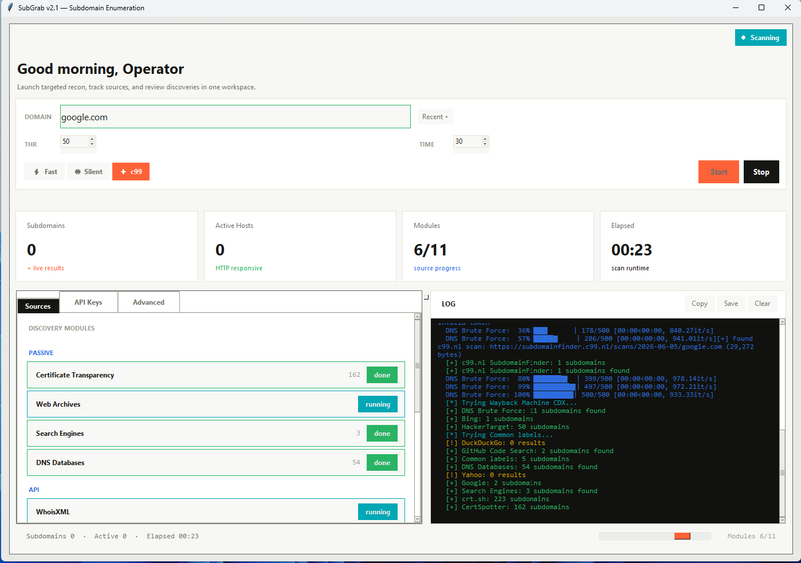

<div align="center">

# 🔍 SubGrab

### Advanced Subdomain Enumeration Tool

[](https://python.org)
[](https://github.com/bidhata/SubGrab/actions/workflows/ci.yml)
[](LICENSE.txt)
[](https://github.com/bidhata/SubGrab/releases)
[](https://github.com/bidhata/SubGrab/releases)
[](https://github.com/bidhata/SubGrab/stargazers)

Multi-threaded subdomain enumeration combining **9 passive sources**, **active recon**, and **AI-powered pattern generation** into a single CLI and GUI tool — no Python required for the Windows binary.

[**⬇️ Download Binary**](https://github.com/bidhata/SubGrab/releases) · [**📖 Quick Start**](#-quick-start) · [**🔌 Plugin Guide**](#-plugin-system) · [**🖥️ GUI**](#-gui-interface)

<br>


</div>

---

## ✨ Features at a Glance

<table>
<tr>
<td width="33%">

**🌐 Passive Discovery**
- Certificate Transparency logs
- Web archives (Wayback / CommonCrawl)
- Search engine dorks
- C99 SubdomainFinder
- DNS databases
- Security APIs (Shodan, VT, Censys…)
- GitHub code search

</td>
<td width="33%">

**🎯 Active Recon**
- HTTP/HTTPS probing + fingerprinting
- Port scanning (SSH, FTP, SMTP…)
- Subdomain takeover detection (50+ services)
- Shodan IP enrichment
- Wildcard DNS filtering

</td>
<td width="33%">

**🤖 AI Generation**
- OpenRouter — Claude 4.5, GPT-5.1, Gemini 2.5…
- Pattern analysis on discovered subdomains
- Runs after traditional sources complete
- Single API key, dozens of models

</td>
</tr>
</table>

---

## 📥 Installation

### Option A — Pre-built Binary (Windows, no Python needed)

```
1. Download SubGrab-vX.X.X-windows-x64.zip from Releases
2. Extract → double-click SubGrab.exe for GUI
              or run SubGrab.exe example.com for CLI
```

### Option B — Run from Source

**Requirements:** Python 3.8+

```bash
git clone https://github.com/bidhata/SubGrab.git
cd SubGrab
pip install -r requirements.txt
```

<details>
<summary>📦 Dependencies</summary>

| Package | Purpose |
|---------|---------|
| `requests` | HTTP client |
| `dnspython` | DNS resolution, zone transfer, SRV |
| `colorama` | Coloured terminal output |
| `beautifulsoup4` | HTML parsing (C99 pages) |
| `lxml` | Fast HTML parser |
| `tqdm` | Progress bars |
| `shodan` | Shodan API client |

</details>

---

## 🚀 Quick Start

```bash
# Passive-only (no API keys required)
python subgrab.py example.com

# Fast mode — skips brute force and reverse DNS
python subgrab.py example.com --fast --threads 100

# Stealth mode — random delays between requests
python subgrab.py example.com --stealth

# AI-powered with OpenRouter (single key, any model)
python subgrab.py example.com --openrouter-key sk-or-YOURKEY

# Full coverage — AI + all APIs
python subgrab.py example.com \
  --openrouter-key sk-or-YOURKEY \
  --shodan-key SHODANKEY \
  --virustotal-key VTKEY \
  --threads 100

# Launch GUI
python subgrab_gui.py        # source
# or
SubGrab.exe                  # binary
```

---

## 📋 CLI Reference

```
subgrab.py domain [options]
```

### ⚙️ General Options

| Flag | Default | Description |
|------|---------|-------------|
| `-t, --threads` | `50` | Worker threads (1–200) |
| `--timeout` | `30` | Request timeout in seconds |
| `--fast` | off | Skip brute force + reverse DNS |
| `--stealth` | off | Add 0.5–2.0s random delays |
| `--proxy-file FILE` | — | Newline-separated proxy list |
| `--wordlist FILE` | built-in | Custom DNS brute force wordlist |
| `--nameservers NS...` | `8.8.8.8 8.8.4.4 1.1.1.1` | DNS resolvers |
| `--output-dir DIR` | `<domain>_results` | Custom report directory |

### 🔑 API Key Flags

| Flag | Service | Free Tier |
|------|---------|-----------|
| `--shodan-key` | Shodan | Limited |
| `--securitytrails-key` | SecurityTrails | 50 req/month |
| `--virustotal-key` | VirusTotal | 4 req/min |
| `--censys-id` + `--censys-secret` | Censys | 250 req/month |
| `--github-token` | GitHub | 5,000 req/hr |
| `--whoisxml-key` | WhoisXML | 500 credits |

### 🤖 AI Flags

| Flag | Default | Description |
|------|---------|-------------|
| `--openrouter-key` | — | OpenRouter API key |
| `--openrouter-model` | `anthropic/claude-sonnet-4.5` | Model ID |

> **Tip:** Store keys in `ai_engine/config.ini` or the GUI's API Keys tab — no need to pass them on every run.

---

## 🏗️ Architecture

```
SubGrab/
├── main.py                  ← unified entry point (GUI or CLI)
├── subgrab.py               ← CLI engine + SubdomainEnumerator
├── subgrab_gui.py           ← dark GUI (Enterprise Slate theme)
├── SubGrab.spec             ← PyInstaller build spec
├── requirements.txt
├── start_subgrab_gui.bat    ← Windows one-click launcher
│
├── modules/                 ← passive scanner plugins (drop .py to add)
│   ├── base.py              ← BaseScanner ABC + load_modules()
│   ├── 01_certificate_transparency.py
│   ├── 02_web_archives.py
│   ├── 03_search_engines.py
│   ├── 04_dns_databases.py
│   ├── 05_whoisxml.py
│   ├── 06_security_apis.py
│   ├── 07_github_search.py
│   ├── 08_dns_bruteforce.py
│   └── 09_reverse_dns.py
│
└── ai_engine/               ← AI generation plugins
    ├── base.py              ← BaseAIEngine + load_ai_engines()
    ├── config.ini           ← API keys (not committed)
    └── openrouter_ai.py
```

`run_passive_discovery()` loads every `BaseScanner` subclass from `modules/` alphabetically.  
`run_ai_engines()` runs after passive discovery so AI sees real discovered patterns.

---

## 🔌 Passive Scanner Modules

| # | Module | Sources | Key Required | Fast-skip |
|---|--------|---------|:---:|:---:|
| 01 | Certificate Transparency | crt.sh · CertSpotter · RapidDNS · urlscan.io | — | ✗ |
| 02 | Web Archives | Wayback Machine CDX · CommonCrawl (latest index) | — | ✗ |
| 03 | Search Engines | Bing (paginated) · DuckDuckGo · Yahoo · Google | — | ✗ |
| 04 | DNS Databases | C99 SubFinder · HackerTarget | — | ✗ |
| 05 | WhoisXML | Subdomain Lookup API | `whoisxml` | ✗ |
| 06 | Security APIs | VirusTotal · SecurityTrails · Censys · Shodan | optional | ✗ |
| 07 | GitHub Search | REST API + HTML fallback | optional | **✓** |
| 08 | DNS Brute Force | Wordlist + permutations + SRV + zone transfer | — | ✗ |
| 09 | Reverse DNS | ±10 IP sweep around discovered addresses | — | **✓** |

> **Fast-skip (✓):** module is bypassed when `--fast` is passed.

<details>
<summary>🧬 C99 Parsing — 3-tier fallback</summary>

1. Parse `class="sd"` elements (primary layout)
2. Try alternative class names: `subdomain`, `host`, `domain`, `sub`, `name`
3. Regex sweep over raw HTML: `[\w][\w\-]*(?:\.[\w\-]+)*\.{domain}`

IP addresses and Cloudflare status are saved to `{domain}_c99_scan.json`.

</details>

<details>
<summary>🔤 DNS Brute Force — permutation expansion</summary>

For each wordlist entry, the module generates:
- Raw word
- `{prefix}-{word}` / `{prefix}{word}` for: `dev test prod uat new old staging beta alpha`
- `{word}-{suffix}` / `{word}{suffix}` for: `dev prod test api app web mobile`
- `{word}1` through `{word}9`

All permutations are deduplicated and resolved in parallel via `ThreadPoolExecutor`.

</details>

---

## 🎯 Active Reconnaissance

After passive discovery, every found subdomain is probed in parallel:

| Check | What it does |
|-------|-------------|
| 🌐 HTTP/HTTPS | Status code, redirect chain, `Server` header, page title |
| 🔌 Port scan | Checks ports 21, 22, 25, 80, 443 |
| 🖥️ Tech detection | Server banner + common framework patterns |
| 🔍 Shodan enrichment | Open ports, CVEs, IP owner (requires key) |
| ⚠️ Takeover detection | CNAME resolution + HTTP body matching vs 50+ service fingerprints |

**Takeover coverage:** AWS S3, Azure (Blob/App/CDN/Traffic Manager), GitHub Pages, Heroku, Netlify, Vercel, Fly.io, Render, Firebase, Fastly, CloudFront, Surge.sh, Zendesk, Ghost, Tumblr, WordPress.com, and 35+ more.

---

## 🤖 AI Integration

AI modules activate **after** all traditional sources — the model analyses real discovered patterns, not guesses.

```
Traditional sources  →  [api, api1, api2, dev-api, staging-api]
                              ↓
                     AI pattern analysis
                              ↓
                 [api3, api-v2, dev-api2, test-api, ...]
```

### OpenRouter — any LLM through one API

```bash
python subgrab.py example.com \
  --openrouter-key sk-or-YOURKEY \
  --openrouter-model anthropic/claude-sonnet-4.5
```

| Model | Quality | Cost |
|-------|---------|------|
| `anthropic/claude-sonnet-4.5` | Excellent · **recommended** | $$ |
| `anthropic/claude-opus-4.5` | Best overall | $$$$ |
| `anthropic/claude-haiku-4.5` | Fast, affordable | $ |
| `openai/gpt-5.1` | Top-tier general | $$$ |
| `openai/gpt-5-mini` | Balanced quality/cost | $$ |
| `openai/o4-mini` | Reasoning | $$ |
| `google/gemini-2.5-pro` | Long context | $$ |
| `google/gemini-2.5-flash` | Fast + cheap | ¢ |
| `x-ai/grok-4.3` | Grok via OpenRouter | $$ |
| `deepseek/deepseek-chat-v3.1` | Open weights | ¢ |
| `~anthropic/claude-sonnet-latest` | Always-current alias | $$ |

Get a key → [openrouter.ai](https://openrouter.ai)

### Which AI strategy to use?

| Situation | Recommendation |
|-----------|---------------|
| First time / low budget | `~anthropic/claude-sonnet-latest` or Gemini 2.5 Flash |
| Regular bug bounty | Claude Sonnet 4.5 |
| Pentest engagement | Claude Opus 4.5 + all API keys |
| Quick recon | `--fast`, no AI |
| Maximum coverage | OpenRouter + all API keys |

---

## 📁 Output

All results written to **`{domain}_results/`**:

```
example.com_results/
├── 📄 all_subdomains.txt        — full deduplicated list
├── ✅ active_subdomains.txt     — HTTP/HTTPS responsive
├── ❌ inactive_subdomains.txt   — non-responsive
├── 🔑 ssh_enabled.txt           — port 22 open
├── ⚠️  takeover_candidates.txt  — potential takeover targets
├── 📊 scan_results.json         — full structured report
├── 📊 scan_results.csv          — spreadsheet-compatible
├── 🌐 report.html               — interactive dashboard with charts
└── 🗄️  {domain}_c99_scan.json   — C99 IP + Cloudflare data
```

<details>
<summary>📄 JSON report schema</summary>

```json
{
  "domain": "example.com",
  "scan_date": "2026-04-18T12:00:00",
  "total_subdomains": 312,
  "active_subdomains": 187,
  "subdomains": {
    "api.example.com": {
      "ip": "93.184.216.34",
      "active": true,
      "status_code": 200,
      "server": "nginx",
      "title": "API Gateway",
      "source": "c99"
    }
  }
}
```

</details>

---

## 🧩 Plugin System

The plugin system is **fully automatic** — drop a `.py` file in `modules/` and it runs on the next scan. No registration. No config changes.

| Action | How |
|--------|-----|
| ➕ Add scanner | Drop `.py` in `modules/` |
| ➖ Remove scanner | Delete the file |
| ⏸️ Disable temporarily | Rename to `_file.py` |
| 🔢 Control order | Use numeric prefix: `12_mysource.py` |

### Zero-import template

`BaseScanner` and `Fore` are **pre-injected** — no imports needed:

```python
# modules/12_my_source.py

class MySource(BaseScanner):
    name           = "My Source"
    description    = "One-line description"
    requires_key   = None   # set to api_keys dict key to auto-skip if absent
    fast_mode_skip = False  # set True to skip with --fast

    def run(self):
        subdomains = set()
        resp = self.get_session().get(
            f"https://api.example.com/subdomains?q={self.domain}", timeout=10)
        for entry in resp.json():
            host = entry.get("hostname", "").strip().lower()
            if host.endswith(f".{self.domain}") and self.is_valid(host):
                subdomains.add(host)
        return subdomains
```

<details>
<summary>📚 BaseScanner API reference</summary>

| Member | Type | Description |
|--------|------|-------------|
| `self.domain` | `str` | Target domain |
| `self.api_keys` | `dict` | All configured API keys |
| `self.subdomains` | `set` | Subdomains found so far |
| `self.subdomain_info` | `dict` | Per-subdomain metadata |
| `self.output_dir` | `str` | Results directory path |
| `self.fast_mode` | `bool` | `True` when `--fast` passed |
| `self.threads` | `int` | Thread count |
| `self.timeout` | `int` | Request timeout (seconds) |
| `self.wordlist` | `str\|None` | Custom wordlist path |
| `self.get_session()` | method | Thread-local `requests.Session` |
| `self.get_resolver()` | method | Thread-local DNS resolver |
| `self.resolve_domain(sub)` | method | Resolve subdomain → IPs or `None` |
| `self.is_valid(sub)` | method | Validate subdomain format |
| `self.stealth_delay()` | method | Sleep 0.5–2s in stealth mode |
| `Fore.RED/GREEN/CYAN/YELLOW` | colorama | Pre-injected color constants |

</details>

<details>
<summary>💡 Real example — AlienVault OTX in 15 lines</summary>

```python
# modules/12_alienvault.py

class AlienVault(BaseScanner):
    name        = "AlienVault OTX"
    description = "Passive DNS from OTX"

    def run(self):
        subdomains = set()
        try:
            url = f"https://otx.alienvault.com/api/v1/indicators/domain/{self.domain}/passive_dns"
            for record in self.get_session().get(url, timeout=15).json().get("passive_dns", []):
                host = record.get("hostname", "").lower().strip()
                if host.endswith(f".{self.domain}") and self.is_valid(host):
                    subdomains.add(host)
        except Exception as e:
            print(f"{Fore.RED}[!] {self.name}: {e}")
        return subdomains
```

Drop it in `modules/` — that's it.

</details>

---

## 🖥️ GUI Interface

```bash
python subgrab_gui.py     # from source
start_subgrab_gui.bat     # Windows one-click
SubGrab.exe               # binary — double-click
```

| Feature | Detail |
|---------|--------|
| Theme | Enterprise Slate dark theme (slate-950 + blue-500 accent) |
| 📐 Layout | Horizontal split — config sidebar + live terminal |
| 🔑 API Keys tab | Show/hide toggles · direct "Get Key" links · auto-save on exit |
| ⚙️ Advanced tab | DNS nameservers · custom wordlist · proxy file |
| 📟 Terminal | ANSI-stripped coloured output · Copy · Clear |
| 📊 Stats bar | Live subdomain count · active count · elapsed timer |
| ✅ Validation | Real-time domain format check (green/red border) |

---

## 🛠️ Troubleshooting

<details>
<summary>CT returns fewer results than expected</summary>

crt.sh rate-limits heavy users. The module retries 3× with exponential backoff and falls back to CertSpotter, RapidDNS, and urlscan.io — all four run regardless of crt.sh status.

</details>

<details>
<summary>No C99 results</summary>

C99 requires a public scan to exist within the last 14 days. If none is found, the tool falls back to HackerTarget automatically.

</details>

<details>
<summary>Google / Yahoo return 0 results</summary>

Search engines frequently block automated requests. Other sources are unaffected — the tool logs a warning and continues.

</details>

<details>
<summary>DNS brute force is slow</summary>

Use a shorter wordlist and reduce threads to avoid hitting DNS rate limits:

```bash
python subgrab.py example.com --wordlist small.txt --threads 20
```

</details>

<details>
<summary>AI returns no subdomains</summary>

Both AI engines require **at least 3 discovered subdomains** to enter pattern-analysis mode. Check API key validity and credit balance at the respective console ([console.x.ai](https://console.x.ai) / [openrouter.ai](https://openrouter.ai)).

</details>

<details>
<summary>401 Unauthorized / 429 Too Many Requests</summary>

- **401** — API key is invalid or expired. Regenerate it from the provider console.
- **429** — Rate limit hit. Add `--stealth` for delays, or wait before re-running.

</details>

---

## 🤝 Contributing

1. Fork the repository
2. Create a feature branch: `git checkout -b feature/new-source`
3. Add your scanner in `modules/` following the template above
4. Test against a domain you own or have written permission to enumerate
5. Open a pull request with a clear description

Bug reports → [open an issue](https://github.com/bidhata/SubGrab/issues)

---

## 📄 License

[MIT License](LICENSE.txt) — free to use, modify, and distribute.

> ⚠️ **Use only on domains you own or have explicit written permission to test.**  
> The authors accept no liability for misuse.

---

<div align="center">

Made by [Krishnendu Paul](https://www.linkedin.com/in/krishpaul/) &nbsp;·&nbsp; [@bidhata](https://github.com/bidhata)

⭐ Star this repo if it helped you

</div>
